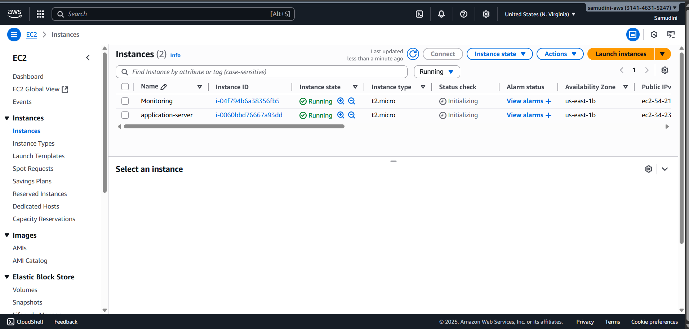
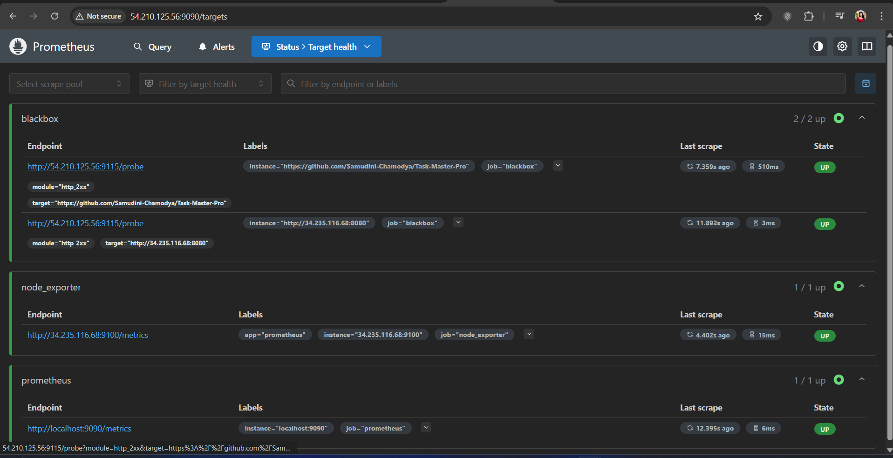

# DevOps Monitoring System with Grafana

## 📋 Project Overview

This project implements a comprehensive monitoring solution for a Java-based Task Master application using industry-standard DevOps tools. The system provides real-time infrastructure monitoring, application health checks, and performance metrics visualization through an intuitive dashboard interface.

## 🏗️ Architecture

The project consists of two primary EC2 instances working in tandem:

**Application Server** - Hosts the Task Master application and exposes system metrics
- IP: `34.235.116.68`
- Services: Task Master App (Port 8080), Node Exporter (Port 9100)

**Monitoring Server** - Collects, processes, and visualizes metrics
- IP: `54.210.125.56`
- Services: Prometheus (Port 9090), Blackbox Exporter (Port 9115), Grafana (Port 3000)

## 🛠️ Technology Stack

### Core Technologies

| Technology | Purpose | Why It's Essential |
|------------|---------|-------------------|
| **Prometheus** | Metrics collection and time-series database | Industry-standard monitoring tool that efficiently scrapes and stores metrics. Provides powerful querying capabilities with PromQL for data analysis |
| **Node Exporter** | System metrics exporter | Exposes hardware and OS-level metrics (CPU, memory, disk, network) in a format Prometheus can consume. Critical for infrastructure monitoring |
| **Blackbox Exporter** | Endpoint monitoring | Probes HTTP/HTTPS endpoints to verify application availability and response times. Essential for uptime monitoring and alerting |
| **Grafana** | Visualization and dashboarding | Creates beautiful, interactive dashboards that make metrics meaningful. Transforms raw data into actionable insights for teams |
| **Java & Maven** | Application runtime and build tool | Java provides the runtime environment for the Task Master application, while Maven handles dependency management and build processes |

### Why This Stack?

This monitoring stack is widely adopted in the industry because it's:
- **Open-source and cost-effective** - No licensing fees
- **Scalable** - Handles monitoring from small applications to large infrastructures
- **Flexible** - Works with virtually any application or service
- **Community-driven** - Extensive documentation and community support

## 📊 Project Setup

### Phase 1: Infrastructure Preparation

#### Step 1: Launch EC2 Instances

Two EC2 instances were provisioned on AWS to separate application workloads from monitoring infrastructure. This separation ensures that monitoring remains operational even if the application experiences issues.


*Two EC2 instances: Application Server and Monitoring Server*

#### Step 2: SSH Connection

Secure connections were established to both servers using SSH key-based authentication.


*Connecting to EC2 instances via SSH*

### Phase 2: Application Server Setup

#### Step 3: Application Deployment

The Task Master application was cloned from the Git repository. Java and Maven were installed to provide the necessary runtime environment for building and running the Spring Boot application.


*Running the Task Master application*

The application successfully started and became accessible at `http://34.235.116.68:8080`


*Task Master application running successfully*

#### Step 4: Node Exporter Installation

Node Exporter was installed to collect system-level metrics from the application server. This agent exposes metrics about CPU usage, memory consumption, disk I/O, and network statistics.


*Starting Node Exporter service*

The exporter started successfully and began exposing metrics at `http://34.235.116.68:9100`


*Node Exporter metrics endpoint*

### Phase 3: Monitoring Server Configuration

#### Step 5: Prometheus Setup

Prometheus was installed on the monitoring server to serve as the central metrics collection and storage system. It periodically scrapes metrics from configured targets and stores them in its time-series database.


*Launching Prometheus service*


*Prometheus web interface at port 9090*

#### Step 6: Prometheus Configuration

The `prometheus.yml` configuration file was edited to define three scrape jobs:

1. **Prometheus self-monitoring** - Monitors Prometheus's own health
2. **Node Exporter** - Collects system metrics from the application server
3. **Blackbox Exporter** - Performs HTTP probes on target URLs


*Configuring scrape targets in prometheus.yml*

prometheus.yml
```
global:
  scrape_interval: 15s # Set the scrape interval to every 15 seconds. Default is every 1 minute.
  evaluation_interval: 15s # Evaluate rules every 15 seconds. The default is every 1 minute.
  # scrape_timeout is set to the global default (10s).

# Alertmanager configuration
alerting:
  alertmanagers:
    - static_configs:
        - targets:
          # - alertmanager:9093

# Load rules once and periodically evaluate them according to the global 'evaluation_interval'.
rule_files:
  # - "first_rules.yml"
  # - "second_rules.yml"

# A scrape configuration containing exactly one endpoint to scrape:
# Here it's Prometheus itself.
scrape_configs:
  # The job name is added as a label `job=<job_name>` to any timeseries scraped from this config.
  - job_name: "prometheus"

    # metrics_path defaults to '/metrics'
    # scheme defaults to 'http'.

    static_configs:
      - targets: ["localhost:9090"]

  - job_name: "node_exporter"
    static_configs:
      - targets: ["34.235.116.68:9100"]
        labels:
          app: "prometheus"

  - job_name: 'blackbox'
    metrics_path: /probe
    params:
      module: [http_2xx]  
    static_configs:
      - targets:
        - http://prometheus.io    
        - https://prometheus.io   
        - http://example.com:8080 
    relabel_configs:
      - source_labels: [__address__]
        target_label: __param_target
      - source_labels: [__param_target]
        target_label: instance
      - target_label: __address__
        replacement: 127.0.0.1:9115
```

**Key Configuration Highlights:**
- Scrape interval set to 15 seconds for near real-time monitoring
- Node Exporter target points to the application server
- Blackbox probes configured for HTTP/HTTPS endpoint monitoring
- Relabel configs ensure proper target labeling for visualization

After restarting Prometheus with the new configuration, all targets appeared in the Prometheus UI:


*Prometheus successfully scraping all configured targets*

#### Step 7: Blackbox Exporter

Blackbox Exporter was installed to perform active probing of HTTP/HTTPS endpoints. This allows monitoring of application uptime, response times, and SSL certificate validity.


*Blackbox Exporter interface showing probe results*

### Phase 4: Visualization with Grafana

#### Step 8: Grafana Installation

Grafana was installed to provide a powerful visualization layer on top of Prometheus metrics. Grafana transforms raw metrics into meaningful dashboards that provide at-a-glance insights into system health.


*Grafana login page at port 3000*

#### Step 9: Dashboard Creation

Two primary dashboards were created to monitor different aspects of the infrastructure:

**Node Exporter Dashboard** - Visualizes system-level metrics from the application server including CPU usage, memory utilization, disk space, network traffic, and system load averages.


*Comprehensive system metrics visualization*

**Blackbox Exporter Dashboard** - Displays endpoint availability, HTTP response codes, probe duration, and SSL certificate expiration timings for monitored URLs.


*HTTP endpoint monitoring and uptime tracking*

## 🎯 Key Features

### Real-Time Monitoring
- Metrics updated every 15 seconds
- Immediate visibility into system performance
- Historical data retention for trend analysis

### Multi-Layer Observability
- **Infrastructure Layer**: CPU, memory, disk, network metrics via Node Exporter
- **Application Layer**: HTTP endpoint health and response times via Blackbox Exporter
- **Monitoring Layer**: Prometheus self-monitoring ensures the monitoring system itself is healthy

### Customizable Dashboards
- Grafana's flexible dashboard system allows for:
  - Custom time ranges and refresh intervals
  - Alert threshold visualization
  - Multiple data sources in a single view
  - Team-specific dashboard configurations

## 🔧 Access Information

| Service | URL | Purpose |
|---------|-----|---------|
| Task Master Application | `http://34.235.116.68:8080` | Main application interface |
| Node Exporter | `http://34.235.116.68:9100` | System metrics endpoint |
| Prometheus | `http://54.210.125.56:9090` | Metrics database and query interface |
| Blackbox Exporter | `http://54.210.125.56:9115` | Probe configuration and results |
| Grafana | `http://54.210.125.56:3000` | Dashboard and visualization |

## 🚀 Benefits of This Setup

### For Development Teams
- Quickly identify performance bottlenecks
- Proactive alerting before users experience issues
- Historical data for capacity planning

### For Operations Teams
- Centralized monitoring reduces mean time to detection (MTTD)
- Clear visibility into system health across all components
- Standardized monitoring approach across environments

### For Business
- Improved application uptime and reliability
- Data-driven infrastructure scaling decisions
- Reduced operational costs through efficient resource utilization


## 🎓 Learning Outcomes

This project demonstrates proficiency in:
- AWS infrastructure management
- Containerized and service-based deployments
- Metrics collection and time-series data management
- Data visualization and dashboard design
- DevOps monitoring best practices

## 📝 Conclusion

This monitoring system provides a solid foundation for observing application and infrastructure health. By leveraging industry-standard open-source tools, the project creates a scalable, maintainable monitoring solution that can grow with organizational needs.

---

**Project Type**: DevOps Monitoring & Observability  
**Technologies**: Prometheus, Grafana, Node Exporter, Blackbox Exporter, AWS EC2  
